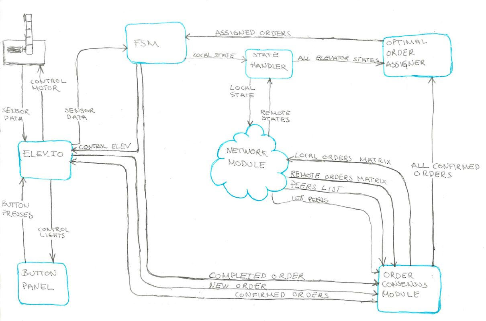

# TTK3145 Elevator Project Spring 2019

## Program overview
Each node cooperates with one another on a peer to peer basis, and each node program consists of the following modules:
- elevio
    - registers button presses, sensor data and controls lights. Informs local fsm of sensor data and consensus of new button presses.
- consensus
    - merges local knowledge about order statuses with remote knowledge supplied by network module. Orders that are agreed upon by all peers will be sent to the optimal assigner module.
- network
    - broadcasts knowledge about all peers' states and orders. Informs consensus module of remote orders and nodestates module of remote states. Keeps track of which peers are visible.
- orderassignment
    - receives all confirmed orders known to the node. Redirects local cab orders to fsm, and filters through the hall orders this node should handle, based on information about all peers' states received by nodestates module.
- nodestates
    - redirects local state from fsm to network module and informs orderassignment about all nodes' states.
- fsm
    - local state machine. Receives orders to handle from orderassignment module and informs consensus module when orders are completed.

The original sketch of the program serves to illustrate the information flow quite well on a higher abstraction level, although some module names have been slightly modified:

## Disclaimer
The following code sections were entirely or partly copied from other works:
- The hall request assigner used by [OptimalAssigner function](./orderassignment/orderassignment.go) was made by github user [klasbo](https://github.com/klasbo) and handed out. The source and documentation can be found [here](https://github.com/TTK4145/Project-resources/tree/master/cost_fns/hall_request_assigner/README.md).
- The [network driver](./network/driver) package is mostly identical to the one handed out, which can be found [here](https://github.com/TTK4145/Network-go/README.md).
